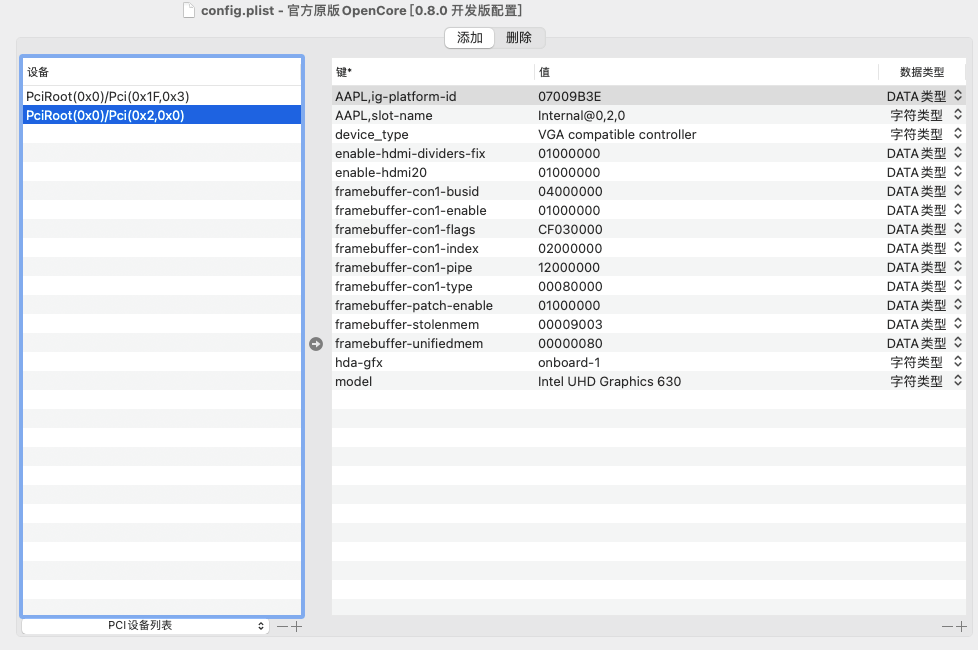

# Hackintosh-Asus-Prime-H410M-A-iGPU

鉴于现阶段十代设备在二手市场比较划算，遂在海鲜市场淘了一套，放客厅看看奈飞~~


# 硬件配置

| 项目 | 型号 | 说明 |
| :------:| :------| :------|
|  主 板  | 华硕 Prime H410M-A | M-ATX主板，不带WIFI，|
|  | Realtek RTL8111H |千兆网卡，主板自带 |
|  | Realtek ALC887 | 主板自带7.1声卡 |
| CPU | Intel i3-10100 | 二手散片性价比相当OK |
|核显|Intel UHD 630 | 核显驱动 |
|内存|光威 天策 DDR4 3200 16GB (8G×2)| 前阵子内存低价囤货，性价比可以|
| NVME | 影驰 擎 512G| 二手矿盘，价格便宜 |


# 软件配置

* 引导: OpenCore 0.8.0 开发版
* 黑果系统: macOS Big Sur 11.6.5 (Macmini8,1)


# 工作情况
| 项目 | 情况 | 说明 |
| :------| :------:| :------|
| 声卡 Realtek ALC887 |✅| AppleALC完美驱动 |
| 核显 UHD630 |✅| 完美驱动， HDMI 输出 |
| 有限网卡 Realtek RTL8111H |✅| OC中配置好，即完美可用。 |
| USB |✅| macOS Big Sur 11.6.5 必须定制，定制后完美。 |
| 电源管理 |✅| 原生电源管理 |


# 具体详情

## 核显 Intel UHD 630

配置参数(缓冲帧):

* ig-platform-id = `07009B3E`

因配置参数(缓冲帧)对应的接口是3个DP，所以在未手动设置端口参数的时候，HDMI启动会紫屏。
解决方案也是简单，就是在确认使用了哪个接口的情况下，把接口的信息由DP改为HDMI，这样就OK了。 




## 声卡

配置参数:

* 必要驱动 ：AppleALC.kext
* layout-id = 1

DeviceProperties: 

```xml
<key>PciRoot(0x0)/Pci(0x1F,0x3)</key>
<dict>
    <key>layout-id</key>
    <integer>1</integer>
</dict>
```

## 有线网卡 Realtek RTL8111H 

OpenCore 内核参数中添加驱动：RealtekRTL8111.kext


## USB定制

机箱是先马趣造，有2个USB 3.0 前置，没有前置的USB-TYPE-C。
我是在Windows下定制的，前、后都定制好的情况下，数量还有的多，所以整体不用取舍。


## 华硕主板开机一直需要 F1 的问题 F1 Boot Error

启用 `Kernel` 的 Quirks : ✅ DisableRtcChecksum


## BIOS 关闭

* Fast Boot 快速启动
* VT-d
* CSM
* Intel SGX


## BIOS 开启

* VT-x 
* Above 4G decoding
* EHCI/XHCI Hand-off
* OS type: Windows UEFI Mode (或者清除所有 Secure Boot Keys 然后选 `Other` )
* DVMT Pre-Allocated(iGPU Memory): 64MB

# EFI

## SSDTs

可以从这里找 [Dortania's ACPI Guide](https://dortania.github.io/Getting-Started-With-ACPI/),直接用就好了

* SSDT-AWAC.aml
* SSDT-EC-USBX-DESKTOP.aml
* SSDT-PLUG-DRTNIA.aml
* SSDT-PMCR.aml


#### Kexts

* Lilu.kext `1.6.1`
* VirtualSMC.kext `1.3.0`
* SMCProcessor.kext `1.3.0`
* SMCSuperIO.kext `1.3.0`
* WhateverGreen.kext `1.5.9`
* AppleALC.kext `1.7.1`
* NVMeFix.kext `1.1.0`
* USBXHCIFixup.kext `1.0.0` #(USB定制辅助驱动，新版本用上就好了)
* USBMap_Macmini8,1.kext #(安装前在 Windows 下定制好USB, Macmini8,1)


## 参考资料

* [OpenCorePkg](https://github.com/acidanthera/OpenCorePkg)
* [OpenCore Install Guide](https://dortania.github.io/OpenCore-Install-Guide/)
